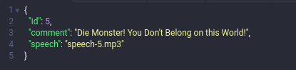

<h1 align="center">
    <br>
</h1>
<hr>

# Summary

- [What is this?](#what-is-this)
- [Techs used](#techs-used)
- [Getting started](#getting-started)
- [API Usage](#api)
- [Useful URLs](#useful-urls)

<a id="what-is-this"></a>

## :thinking: What is this?

This is the Server Side of my interview application in **Smarkio**.<br>
Basically, a REST API that consists of converting text to speech using the **IBM Watson Cloud** platform.

**Client-Side** available: [Here](https://github.com/matheus2x/smarkio-case-client/ "Client-Side")

<a id="techs-used"></a>

## :rocket: Techs used

- **Node.js** - A JavaScript Interpreter
- **TypeScript** - A Superset for JavaScript
- **MySQL** - A Relational Database
- **Knex.js** - A SQL Query Builder
- **Docker** - A Container Creator
- **Docker Compose** - A Container Orchestrator

<a id="getting-started"></a>

## :fire: Getting started

- ### You may **need** to install:

  - A Distributed **Version-Control-System** -> [Git](https://git-scm.com/ "Git")
  - A JavaScript **Interpreter** -> [Node.js](https://nodejs.org/ "Node.js")
  - Some **Package Manager** Like -> [NPM](https://www.npmjs.com/) **or** [Yarn](https://yarnpkg.com/)
  - The Relational **Database** -> [MySQL](https://www.mysql.com/ "MySQL")
  - Container **Docker** -> [Docker](https://docs.docker.com/get-docker/ "Docker")
  - Container Orchestrator **Docker Compose** -> [Docker Compose](https://docs.docker.com/compose/install/ "Docker Compose")

- ### Others requirements:

  - A **IBM Watson Cloud** Account -> [IBM-Register](https://cloud.ibm.com/ "IBM-Register")
  - On your **IBM account**, you will need to use the **Text To Speech (TTS)** service.

1. Clone this repo with:

```sh
  $ git clone https://github.com/matheus2x/smarkio-case-server.git
```

2. Move yourself to the appropriate directory: `$ cd smarkio-case-server`
3. Change `.env.example` credentials
4. Rename `.env.example` to `.env`

#### Now, we have 2 paths: **With** Docker and **Without** Docker:

- ### **With** Docker:

Attention: If you are going on this way, **don't** change `MYSQL_HOST` in `.env.example`

1. Run `$ docker-compose up --build -d` to build docker-compose
2. Run `$ npm run populate` to run migrations/seeds

- ### **Without** Docker:

1. To insalling dependencies, run: `$ npm install`
2. In your MYSQL, create a DB (with the same name as in your `.env`):

```SQL
CREATE DATABASE someDatabase;
```

3. Run `$ npm run build` to compile ts to js
4. Run `$ npm run knex:migrate` to run migrations
5. Run `$ npm run knex:seed` to run seeds

### If you've done Everything so far, you can now Start the [Client-Side](https://github.com/matheus2x/smarkio-case-client).

<br>

<a id="api"></a>

## :orange_book: API Usage

Attention: Omit the braces <code>{}</code> from examples. They indicate variable values

### Routes

#### 1. Create a new speechable comment:

Method: `POST` <br>
Route: `http://localhost:{NODE_PORT}/tts` <br>
Request Body: `Message you want to convert to speech` and the `voiceLang` <br>
Output w/ Datatype:

```javascript
  {
    "id": Number,
    "comment": String,
    "speech": String
  }
```

<details>
  <summary>Example:</summary>

Method: `POST` <br>
Route: `http://localhost:3333/tts` <br>
Request Body: `Die Monster! You Don't Belong on this World!` <br>
Output:

<h1 align="left">
    <br>
</h1>
</details> <br>

#### 2. Listen to the comment speech:

Method: `GET` <br>
Route: `http://localhost:{NODE_PORT}/uploads/speech-{commentID}.mp3` <br>
Output: `audio.mp3 bynary file` <br>

<details>
  <summary>Example:</summary>

Method: `GET` <br>
Route: `http://localhost:3333/uploads/speech-1.mp3` <br>
Output: [speech-1.mp3](https://github.com/matheus2x/smarkio-case-server/blob/master/uploads/speech-1.mp3) <br>
Listen audio in Vocaroo: https://voca.ro/1kSLOdtoUecV

</details> <br>

#### 3. Index all comments in DB:

Method: `GET` <br>
Route: `http://localhost:{NODE_PORT}/tts` <br>
Output w/ Datatype:

```javascript
  [
    {
      "id": Number,
      "comment": String,
      "audio": String
    },
    {
      "id": Number,
      "comment": String,
      "audio": String
     }
     ...
  ]
```

<details>
  <summary>Example:</summary>

Method: `GET` <br>
Route: `http://localhost:3333/tts` <br>
Output:

```javascript
  [
    {
      "id": 1,
      "comment": "Die Monster! You Don't Belong on this World!",
      "speech": "http://localhost:3333/uploads/speech-5.mp3"
    },
     ...
  ]
```

</details> <br>

<a id="useful-urls"></a>

## :link: Useful URLs

- [Client Side](https://github.com/matheus2x/smarkio-case-client/ "Client Side")

---

- [Git](https://git-scm.com/ "Git")
- [Node](https://nodejs.org/ "Node")
- [Yarn](https://yarnpkg.com/ "Yarn")
- [MySQL](https://www.mysql.com/ "MySQL")
- [Docker](https://www.docker.com/ "Docker")
- [IBM-Watson-Cloud](https://cloud.ibm.com/ "IBM-Watson-Cloud")

---

<h4 align="center">
    Made with :fox_face: by <a href="https://www.linkedin.com/in/matheus2x/" target="_blank">Matheus Henrique</a>
</h4>
